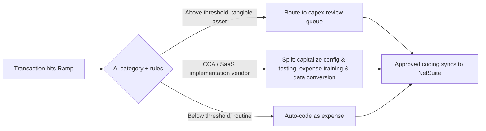

# Topic 2 — The First 90 Days at Vast

## 30 days — learn the machine

- Map the current chart of accounts, capitalization policy, and threshold — what's Vast's dollar line between capitalize and expense today, and is it documented or tribal knowledge?
- Understand how Ramp is actually configured: category mappings, AI-suggested coding accuracy, which dimensions (department/class/location) are in use.
- Shadow month-end close and flag where manual reclasses happen most — that's where the friction, and the opportunity, live.

## 60 days — start contributing

- Tighten the GL coding rules for the judgment calls that recur most — CCA/SaaS implementation costs, capex threshold edge cases.
- Partner with the controller/FP&A on documenting the capitalization policy crisply, if it isn't already.
- Start quantifying the manual-reclass problem: how many per month, how much time it costs.

## 90 days — ship something

- Pilot the idea below on a narrow slice of spend, with a before/after on reclass volume.
- Bring a lightweight business case, not just a demo.

## The idea

**Route the capitalize-vs-expense decision to the point of transaction entry in Ramp, not to close.**

AI-assisted coding in Ramp is tuned for speed and general category accuracy — not purpose-built to catch the two judgment calls that create rework later: an invoice that crosses the capitalization threshold, or a SaaS vendor bill that blends capitalizable implementation work (configuration, customization, testing) with costs that must stay expensed (training, data conversion) on the same invoice.

The idea: a rules layer on top of Ramp's existing categorization that flags those two patterns *before* they sync to NetSuite, and routes them to a short review queue instead of posting straight through.

Small build, immediate payoff: fewer reclass journal entries at close, a cleaner audit trail, and a policy that used to live in someone's head now lives in the system.
